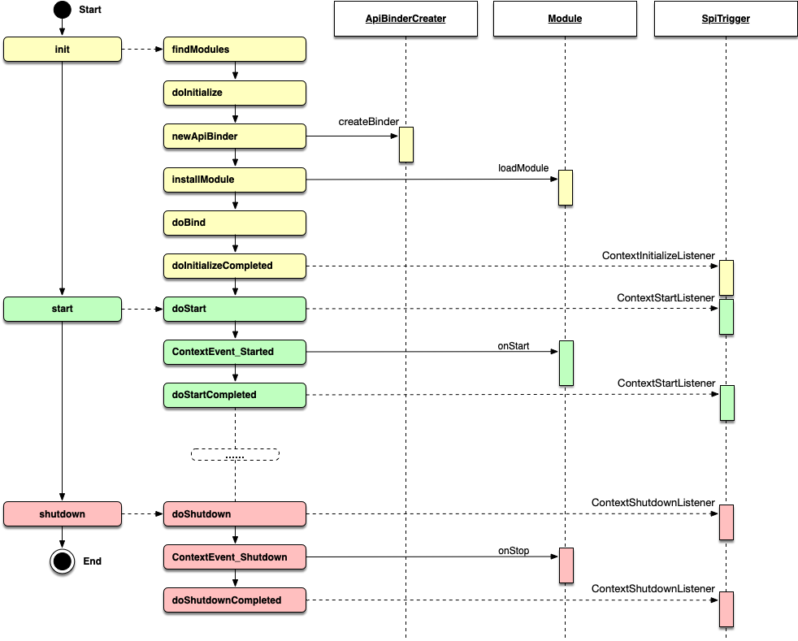

模块生命周期
------------------------------------
Hasor 的生命周期大致分为三个阶段：`init`、`start`、`shutdown`，其中在启动时会一次性完成 init、start 两步操作。如果您想深入到代码层面了解 Hasor 启动和销毁的细节逻辑，那么请参考 `TemplateAppContext` 类。

面我们对每一个重要的节点做一个简单的介绍，这些过程代码你可以在 ``TemplateAppContext`` 类中找到它们。

**一、Init阶段**

- `findModules` ：在配置文件中，查找找所有可以加载的 Module。
- `doInitialize` ：执行 init 阶段的起始标志，默认是空实现。
- `newApiBinder` ：创建 Module 在执行 loadModule 方法时用到的 ApiBinder 对象。包括 ApiBinder 的扩展机制也是在这里给予支持。
- `installModule` ：加载每一个 Module，简单来说就是一个 for。
- `doBind` ：容器级的初始化操作，这个过程细分为 doBindBefore、installModule、doBindAfter 三个部分。
- `doInitializeCompleted` ：执行 init 阶段的终止标志，默认是空实现。

**二、Start阶段**

- `doStart` ：执行 start 阶段的起始标志。
- `ContextEvent_Started` ：通过事件机制发送 `AppContext#ContextEvent_Started` 事件。
- `doStartCompleted` ：执行 start 阶段的终止标志。

**三、Shutdown阶段**

- `doShutdown` ：执行 shutdown 阶段的起始标志。
- `ContextEvent_Shutdown` ：发送 `AppContext#ContextEvent_Shutdown` 事件。
- `doShutdownCompleted` ：执行 shutdown 阶段的终止标志。

提示：Hasor 在 start 时候会通过 `Runtime.getRuntime().addShutdownHook(...)` 注册一个钩子用于在 JVM 推出时自动执行 shutdown。

现在我们用一个小例子来想你展示 Hasor 生命周期的特征，首先我们新建一个类，这个类实现了 LifeModule 接口。我们在每一个周期到来时打印一行日志。

.. code-block:: java
    :linenos:

    public class OnLifeModule implements Module {
        public void loadModule(ApiBinder apiBinder) throws Throwable {
            logger.info("初始化拉...");
        }
        public void onStart(AppContext appContext) throws Throwable {
            logger.info("启动啦...");
        }
        public void onStop(AppContext appContext) throws Throwable {
            logger.info("停止啦...");
        }
    }

接下来我们用最简单的方式启动 Hasor 并加载这个 Module，当 Hasor 启动之后我们可以看到控制台上先后打印出 “初始化拉...”、“启动啦...”，当jvm 退出时我们还会看到控制台打印“停止啦...”。

**使用SPI机制**

.. code-block:: java
    :linenos:

    AppContext appContext = Hasor.create().build(apiBinder -> {
        apiBinder.bindSpiListener(ContextInitializeListener.class, new ContextInitializeListener() {
            @Override
            public void doInitializeCompleted(AppContext templateAppContext) {
                ....
            }
        });
    });

**使用事件机制**

.. code-block:: java
    :linenos:

    public void loadModule(ApiBinder apiBinder) throws Throwable {
        EventListener<AppContext> eventListener = ...;
        // 启动事件
        HasorUtils.pushStartListener(apiBinder.getEnvironment(), eventListener);
        // 停止事件
        HasorUtils.pushShutdownListener(apiBinder.getEnvironment(), eventListener);
    }
