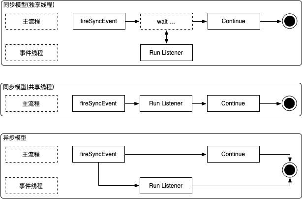

在代码层面往往多个系统之间还会有直接或者间接的调用，这回提升代码耦合度还是很高。这个时候您可以适当的使用 Hasor 的事件机制来进行深度解耦。

Hasor 事件的执行分为三种： **同步(独享线程)**、 **同步(共享线程)**、 **异步**，它们的执行模型如下：

无论是同步的事件模型，还是异步事件模型。在 Hasor 事件体系中，它们都有以下共同性质：

1. 按注册顺序执行事件监听器
2. 事件监听器接口相同
3. 事件注册方式相同

后面会有专门的文章分别介绍 Hasor 的各类事件机制差异点。在开始这些内容之前，现在先让我们来看一看如何注册事件监听器。首先我们先实现一个事件监听器：

.. code-block:: java
    :linenos:

    import net.hasor.core.EventListener;
    public class MyListener implements EventListener<Object> {
        public void onEvent(String event, Object eventData) throws InterruptedException {
            Thread.sleep(500);
            System.out.println("Receive Message:" + JSON.toJSONString(eventData));
        }
    }

在 Hasor 中事件的注册和发送都是通过 EventContext 发送出去的。因此您需要首先拿到这个接口对象，才能将事件监听器注册上。下面是不同的情况下如何取得 EventContext 接口的例子：

.. code-block:: java
    :linenos:

    ApiBinder apiBinder = ...
    EventContext ec = apiBinder.getEnvironment().getEventContext();

.. code-block:: java
    :linenos:

    AppContext appContext = ...;
    EventContext eventContext = appContext.getInstance(EventContext.class);
    or
    EventContext eventContext = appContext.getEnvironment().getEventContext();

.. code-block:: java
    :linenos:

    public class MyBean{
        @Inject
        private EventContext eventContext;
    }

接着我们通过 EventContext 将事件注册到容器中。

.. code-block:: java
    :linenos:

    EventContext eventContext = ...
    eventContext.addListener("EventName",new MyListener());

在注册完毕之后我们可以引发事件：

.. code-block:: java
    :linenos:

    eventContext.fireSyncEvent("EventName",...);

同步事件
------------------------------------
同步事件，同步事件是指当主流程引发事件时，是否阻塞主流程执行，等待所有事件监听器都执行完毕之后在恢复主流程的执行。同步调用的好处是相当于在不动原有代码的情况下通过事件监听器的方式可以动态的增减业务逻辑代码。下面就同步事件的特点加以详细说明

特点：

- 主流程的调用等待事件执行完毕。

根据执行事件监听器线程模型的不同还可以分为：

- 独享线程：指的是当 Hasor 开始执行事件监听器时，使用一个全新的线程去执行监听器。
- 共享线程：指的是当 Hasor 开始执行事件监听器时，使用当前线程执行监听器。

.. code-block:: java
    :linenos:

    // 独享线程
    EventContext eventContext = ...
    eventContext.fireSyncEventWithEspecial(EventName, ...);

    // 共享线程
    EventContext eventContext = ...
    eventContext.fireSyncEvent(EventName, ...);

.. CAUTION::
    独享线程下，如果大量的事件抛出，可能会导致性能下降。

异步事件
------------------------------------
异步事件，异步事件是指当主流程引发事件时，不阻塞主流程，事件的执行完全交给事件线程进行异步调用。如果同时引发多个异步事件，会存在并发执行的情况。异步事件非常适合用于不影响主流程的消息通知。下面就异步事件的特点加以详细说明

特点是：

- 主流程的调用在引发事件之后即刻返回，事件执行异步并发进行。

触发异步事件的方法为：

.. code-block:: java
    :linenos:

    EventContext eventContext = ...
    eventContext.fireSyncEvent(EventName, ...);

异步事件有两种工作方式，由 FireType 枚举定义：

- Interrupt（顺序执行所有监听器，如果中途出错，那么终止执行）
- Continue（顺序执行所有监听器，如果中途出错，那么继续执行下一个监听器）

fireSyncEvent 方法默认的执行方式是 Interrupt，下面是两者的触发方式：

.. code-block:: java
    :linenos:

    EventContext eventContext = ...
    eventContext.fireSyncEvent(EventName, ... ,FireType.Interrupt);
    or
    eventContext.fireSyncEvent(EventName, ... ,FireType.Continue);

执行一次的事件
------------------------------------
执行一次的事件，这是一类特殊的事件执行方式。无论您注册的是 `同步事件` 还是 `异步事件` 都可以将事件监听器注册为只执行一次这种模式。

只执行一次，这种事件通常是用在 Hasor 在 init 过程中注册一个 `ContextEvent_Started` 事件。当应用启动引发 Started 事件之后自动注销事件监听器。

下面这行代码就是注册方式：

.. code-block:: java
    :linenos:

    EventContext eventContext = ...
    eventContext.pushListener("EventName",new MyListener());

事件链
------------------------------------
事件链，指的是在事件中引发另一个或多个事件，一个完整的事件链的例子如下：

.. code-block:: java
    :linenos:

    public class MyListener implements EventListener<Object> {
        public void onEvent(String event, Object eventData) throws InterruptedException {
            Thread.sleep(500);
            System.out.println("Receive Message:" + JSON.toJSONString(eventData));
            throw new NullPointerException();
        }
    }

    public class EventLinkTest {
        @Test
        public void syncEventTest() throws InterruptedException {
            System.out.println("--->>syncEventTest<<--");
            AppContext appContext = Hasor.createAppContext();
            EventContext ec = appContext.getEnvironment().getEventContext();
            //
            final String EventName = "MyEvent";//事件链的终端
            final String SeedEvent = "SeedEvent";//种子事件
            //1.添加事件监听器
            ec.addListener(EventName, new MyListener());
            ec.addListener(SeedEvent, new EventListener<AppContext>() {
                public void onEvent(String event, AppContext app) throws Throwable {
                    EventContext localEC = app.getEnvironment().getEventContext();
                    System.out.println("before MyEvent.");
                    localEC.fireAsyncEvent(EventName, 1);
                    localEC.fireAsyncEvent(EventName, 2);
                }
            });
            //2.引发种子事件
            ec.fireAsyncEvent(SeedEvent, appContext);
            //3.由于是异步事件，因此下面这条日志会在所有事件之前喷出
            System.out.println("before All Event.");
            Thread.sleep(1000);
        }
    }

事件线程池
------------------------------------
默认配置下，Hasor 执行事件的线程池是 20 您可以通过下面两种方式修改这个设定：

.. code-block:: xml
    :linenos:

    <?xml version="1.0" encoding="UTF-8"?>
    <config xmlns="http://www.hasor.net/sechma/main">
        <hasor.environmentVar>
            <!-- 执行事件的线程池大小 -->
            <HASOR_LOAD_EVENT_POOL>20</HASOR_LOAD_EVENT_POOL>
        </hasor.environmentVar>
    </config>

.. code-block:: xml
    :linenos:

    <?xml version="1.0" encoding="UTF-8"?>
    <config xmlns="http://www.hasor.net/sechma/main">
        <!-- 执行事件的线程池大小 -->
        <hasor.eventThreadPoolSize>20</hasor.eventThreadPoolSize>
    </config>
