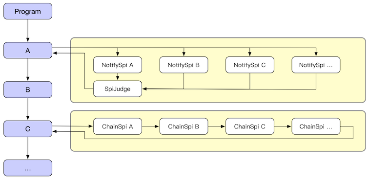

--------------------
SPI 机制
--------------------
SPI 全称 Service Plugin Interface，它的本真意图是在应用执行流程过程中，安插一些扩展点。
通过这些扩展点让一个看似固定的代码流程变得可以动态扩展。甚至影响执行流程中的状态。

SPI 分为两种模式，它们的工作原理如下：

**notifySpi（通知型）**

    每个SPI在被调用的时彼此并不能互相影响。notifySpi 在执行的时候如果带有返回值，那么这个返回值会被用作发起调用 SPI 之后的返回值返回。
    但当一个 notifySpi 注册了多个监听器时。由于发起 SPI 调用只能有一个返回值，因此需要 SpiJudge 来协助返回值的选择，默认 SpiJudge 是选取最后一个。

**chainSpi（链型）**

    链型的类似 AOP拦截器或者叫做 Filter 过滤器，它存在的目的是让 Spi监听器 允许出现前后依赖关系。利用这个关系 SPI 监听器可以实现更为复杂的逻辑。
    比如：利用 chainSpi 可以非常方便的在程序流程中某一段逻辑上开启 Aop 能力。

SPI 监听器
------------------------------------
无论是 ``notifySpi`` 还是 ``chainSpi`` 一个 SPI 监听器必须是继承或者实现 ``java.util.EventListener`` 接口。
除此之外两种类型的 SPI 在定义的时候并无实质区别。

** 关于命名 **

    - 通常而言 ``notifySpi`` 监听器的命名会以 ``xxxListener`` 形式出现。
    - 而 ``chainSpi`` 监听器的命名则 ``xxxxChainSpi`` 形式居多。

以下是现有 Hasor 已经支持的 SPI 列表，涵盖所有已知模块。

+-----------+--------------------------------------------------+----------+
| 类别      | 接口                                             | 所属模块 |
+-----------+--------------------------------------------------+----------+
| NotifySpi | net.hasor.core.spi.ContextStartListener          | Core     |
+-----------+--------------------------------------------------+----------+
| NotifySpi | net.hasor.core.spi.ContextShutdownListener       | Core     |
+-----------+--------------------------------------------------+----------+
| NotifySpi | net.hasor.core.spi.CreatorProvisionListener      | Core     |
+-----------+--------------------------------------------------+----------+
| NotifySpi | net.hasor.core.spi.BindInfoProvisionListener     | Core     |
+-----------+--------------------------------------------------+----------+
| NotifySpi | net.hasor.core.spi.ScopeProvisionListener        | Core     |
+-----------+--------------------------------------------------+----------+
| NotifySpi | net.hasor.core.spi.ContextInitializeListener     | Core     |
+-----------+--------------------------------------------------+----------+
| ChainSpi  | net.hasor.core.spi.CollectScopeChainSpi          | Core     |
+-----------+--------------------------------------------------+----------+
| NotifySpi | net.hasor.dataway.spi.CompilerSpiListener        | Dataway  |
+-----------+--------------------------------------------------+----------+
| ChainSpi  | net.hasor.dataway.spi..ParseParameterChainSpi    | Dataway  |
+-----------+--------------------------------------------------+----------+
| ChainSpi  | net.hasor.dataway.spi.PreExecuteChainSpi         | Dataway  |
+-----------+--------------------------------------------------+----------+
| ChainSpi  | net.hasor.dataway.spi.ResultProcessChainSpi      | Dataway  |
+-----------+--------------------------------------------------+----------+
| NotifySpi | net.hasor.tconsole.spi.TelAfterExecutorListener  | tConsole |
+-----------+--------------------------------------------------+----------+
| NotifySpi | net.hasor.tconsole.spi.TelBeforeExecutorListener | tConsole |
+-----------+--------------------------------------------------+----------+
| NotifySpi | net.hasor.tconsole.spi.TelHostPreFinishListener  | tConsole |
+-----------+--------------------------------------------------+----------+
| NotifySpi | net.hasor.tconsole.spi.TelSessionCreateListener  | tConsole |
+-----------+--------------------------------------------------+----------+
| NotifySpi | net.hasor.tconsole.spi.TelSessionDestroyListener | tConsole |
+-----------+--------------------------------------------------+----------+
| NotifySpi | net.hasor.tconsole.spi.TelStartContextListener   | tConsole |
+-----------+--------------------------------------------------+----------+
| NotifySpi | net.hasor.tconsole.spi.TelStopContextListener    | tConsole |
+-----------+--------------------------------------------------+----------+
| NotifySpi | net.hasor.web.spi.AfterResponseListener          | web      |
+-----------+--------------------------------------------------+----------+
| NotifySpi | net.hasor.web.spi.BeforeRequestListener          | web      |
+-----------+--------------------------------------------------+----------+
| NotifySpi | net.hasor.web.spi.MappingDiscoverer              | web      |
+-----------+--------------------------------------------------+----------+
| NotifySpi | net.hasor.web.spi.ServletContextListener         | j2ee     |
+-----------+--------------------------------------------------+----------+
| NotifySpi | net.hasor.web.spi.HttpSessionListener            | j2ee     |
+-----------+--------------------------------------------------+----------+
| NotifySpi | net.hasor.web.spi.ServletRequestListener         | j2ee     |
+-----------+--------------------------------------------------+----------+

SPI 触发器
------------------------------------
ChainSpi 和 NotifySpi 的主要区别就在于使用了不同的 SPI 触发器方法进行触发，进而执行不同的 SPI 处理流程。

我们假设一个简单的例子，一共要打印三行控制台输出。这个程序是这个样子的：

.. code-block:: java
    :linenos:

    System.out.println("A");
    System.out.println("B");
    System.out.println("C");

现在，我们希望在不影响代码流程的情况下。在输出 B 这个代码之前插入若干流程，流程是通过 SPI 的方式动态注册的。首先声明一个 SPI 接口。

.. code-block:: java
    :linenos:

    public interface MySpiListener extends EventListener {
        public void doSpi();
    }

然后改动现有代码，在适当的地方安插调用 SPI 的逻辑。

.. code-block:: java
    :linenos:

    @Inject
    private SpiTrigger spiTrigger；

    System.out.println("A");
    // do spi
    spiTrigger.notifySpiWithoutResult(MySpiListener.class, new SpiCallerWithoutResult<MySpiListener>() {
        public void doSpi(MySpiListener listener) throws Throwable {
            listener.doSpi();
        }
    });
    System.out.println("B");
    System.out.println("C");

最后可以在 Module 的加载过程中注册 MySpiListener。

.. code-block:: java
    :linenos:

    public class RootModule implements Module {
        public void loadModule(ApiBinder apiBinder) throws Throwable {
            ...
            apiBinder.bindSpiListener(MySpiListener.class, new MySpiListenerImpl());
            ...
        }
    }

SPI 仲裁器
------------------------------------
冲裁器有两个作用

- 一个是可以决定最终执行的 SPI 监听器是哪些，以及它们的顺序。
- 另一个作用是帮助 NotifySpi 型 SPI 调用决定采用哪个返回值。

.. code-block:: java
    :linenos:

    // 注册监听器
    AppContext appContext = Hasor.create().build(apiBinder -> {
        apiBinder.bindSpiListener(TestSpi.class, (obj) -> {
            ...
            return dataA;
        });
        apiBinder.bindSpiListener(TestSpi.class, (obj) -> {
            ...
            return dataB;
        });
        apiBinder.bindSpiJudge(TestSpi.class, new SpiJudge() {
            // 改变仲裁默认行为，可以选取第一个值
            public <R> R judgeResult(List<R> result, R defaultResult) {
                return result.get(0);
            }
            // 决定那些 SPI 有效，并且它们的顺序
            public <T extends java.util.EventListener> List<T> judgeSpi(List<T> spiListener) {
                return spiListener;
            }
        });
    });
    // 触发 SPI 调用
    SpiTrigger spiTrigger = appContext.getInstance(SpiTrigger.class);
    Object resultSpi = spiTrigger.notifySpi(TestSpi.class, new SpiCaller<TestSpi, Object>() {
        public Object doResultSpi(TestSpi listener, Object lastResult) throws Throwable {
            return listener.doSpi(lastResult);
        }
    }, defaultResult);
    // 2个SPI，默认仲裁会返回最后一个 dataB 而不是 dataA
    assert resultSpi == dataA;
