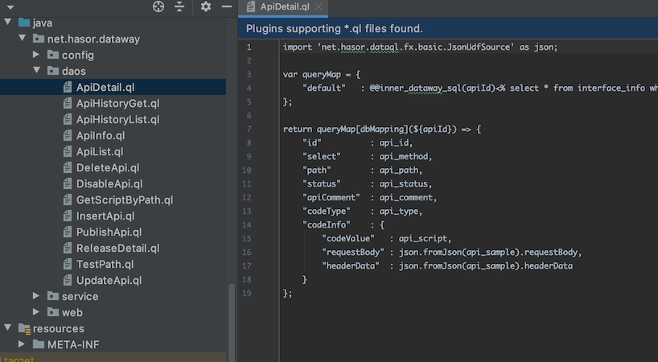
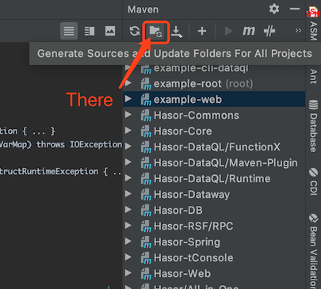
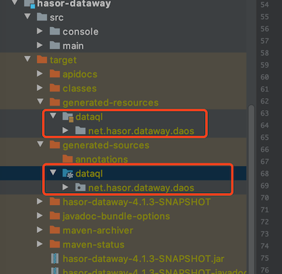

配置 Maven 插件
------------------------------------
DataQL Maven 插件的作用是，根据 DataQL 查询文件生成对应的查询工具类。从而Java应用程序中使用 DataQL 查询能力更加方便快捷。

引入插件

.. code-block:: xml
    :linenos:

    <plugin>
        <groupId>net.hasor</groupId>
        <artifactId>dataql-maven-plugin</artifactId>
        <version>4.1.7</version>
        <executions>
            <execution>
                <goals>
                    <goal>dataql</goal>
                </goals>
            </execution>
        </executions>
    </plugin>

插件会扫描 ``sourceDirectory`` 配置的路径中所有 `.ql` 结尾的查询文件，
并在 ``outputSourceDirectory`` 配置的路径下自动生成对应的 Java 代码，
原始的 Query 查询文件会拷贝到 ``outputResourceDirectory`` 配置的目录下。

各个配置的默认值

+-----------------------------+-------------------------------------------------------+
| **满足条件**                |  **默认值**                                           |
+-----------------------------+-------------------------------------------------------+
| ``outputSourceDirectory``   | ${project.build.directory}/generated-resources/dataql |
+-----------------------------+-------------------------------------------------------+
| ``outputResourceDirectory`` | ${project.build.directory}/generated-sources/dataql   |
+-----------------------------+-------------------------------------------------------+
| ``sourceDirectory``         | ${basedir}/src/main/java                              |
+-----------------------------+-------------------------------------------------------+

插件工作在 GENERATE_SOURCES 阶段，依赖的范围是：COMPILE

详细配置查看：`Maven 配置页面 <../../../maven-plugin/hasor-dataql/plugin-info.html>`_

下面这个接口是生成的类的接口模板

.. code-block:: java
    :linenos:

    public class ListOptionQuery extends HintsSet implements Query {
        // 构造方法
        private ListOptionQuery(HintsSet hintsSet) { ... }
        public ListOptionQuery() throws IOException, ParseException { ... }
        public ListOptionQuery(DataQL dataQL) throws IOException, ParseException { ... }
        public ListOptionQuery(Finder finder, Map<String, VarSupplier> shareVarMap) throws IOException, ParseException { ... }
        // 方法
        public QueryResult execute(CustomizeScope customizeScope) throws InstructRuntimeException { ... }
        public ListOptionQuery clone() { ... }
    }

编写QL文件
------------------------------------
新建 daos 包，例如： ``net.hasor.demo.daos``

.. HINT::
    包名没有特殊要求，可以是任何一个。DataQL-Maven 插件 不会对其有要求。

新建 ``.ql`` 文件，然后在 ql 文件中编写 DataQL 查询。如下：

执行QL查询
------------------------------------
如果使用的是 Idea 编辑器，那么可以打开 Maven 侧边栏，在顶部有一个 ``Generate Sources and Update Folders For ALL Projects`` 按钮
可以点击它重新生成 DataQL 查询代码。

点击生成之后，Maven 会自动在 target 目录下生成两个目录。这两个目录会在=最后参与打包和编译，DataQL Maven 插件生成的 ql 调用代码就在这里。

有了生成的代码就可以在程序中方便的执行 QL 语句了，通常在执行 Query 的时候会传入 DataQL 接口对象。

.. code-block:: java
    :linenos:

    QueryResult queryResult = new ApiInfoQuery(this.dataQL).execute(new HashMap<String, String>() {{
        put("apiId", apiId);
    }});

.. HINT::
    DataQL 的工具框架 Dataway 的整个 dao 层就是通过，DataQL 构建的。有兴趣的可以获取它的代码观摩一下。