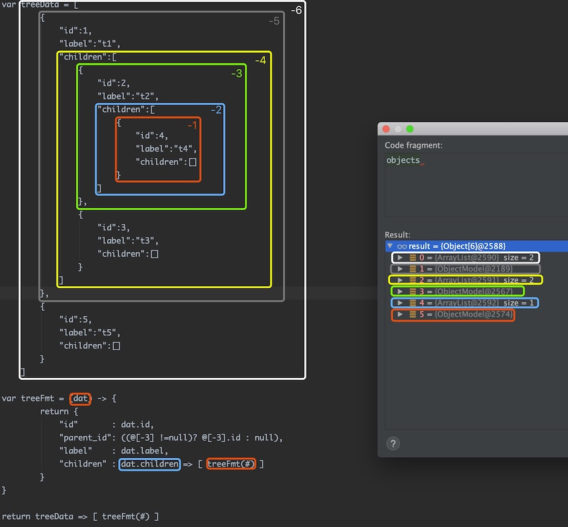

--------------------
访问符
--------------------

取值域
------------------------------------
取值域是一种隔离机制。例如：同样名称的参数可以出现在不同的 ``值域`` 里。在 DataQL 中一共有三个可以用的值域符号：

+----------+---------------------+
| **符号** | **值域**            |
+----------+---------------------+
| $        | 值域符 A            |
+----------+---------------------+
| #        | 值域符 B            |
+----------+---------------------+
| @        | 值域符 C            |
+----------+---------------------+

值域符的应用场景只有两个

    - 获取程序传来的参数
    - 表达式中的访问符

获取程序传来的参数
------------------------------------
获取程序传入的参数必须使用：``<访问符>{<参数名>}`` 方式来获取，这个特性类似 ``带参的SQL``。例如：

    - ``${abc}`` 或 ``@{abc}`` 或 ``#{abc}``

.. HINT::
    DataQL 的值域，在开发者没有明确分别它们的时候。三个访问符的值域内容是没有任何区别的。其中符号 ``$`` 由于被很多语言经常使用相对比较亲切，因此这成为一个较为常用的访问符。

用不同值域隔离同名参数的例子：

.. code-block:: java
    :linenos:

    // 创建一个 Map 为每个值域中都放入不同变量，但是变量名都是 'a'
    Map<String, Map<String, Object>> objectMap = new HashMap<>();
    objectMap.put("#", new HashMap<String, Object>() {{
        put("a", 1);
    }});
    objectMap.put("$", new HashMap<String, Object>() {{
        put("a", 2);
    }});
    objectMap.put("@", new HashMap<String, Object>() {{
        put("a", 3);
    }});

然后通过 Query 接口创建查询并执行查询（通过 CustomizeScope 接口来返回不同访问符的数据Map）

.. code-block:: java
    :linenos:

    DataQL dataQL = ...
    Query query = dataQL.createQuery("return [#{a},${a},@{a}];");
    DataModel dataModel = query.execute(new CustomizeScope() {
        public Map<String, ?> findCustomizeEnvironment(String symbol) {
            return objectMap.get(symbol);
        }
    }).getData();

最后就会得到：``[1, 2, 3]`` 这样的结果。

表达式访问符原理
------------------------------------
表达式访问符同样使用了 ``@、#、$`` 三个符号。在表达式中的访问符是指类似如下的取值表达式：

    - ``$ss.sss.sss``
    - ``#ss[abc].sss.sss``
    - ``@abc.abc(true).sss``

要理解这种带有访问符的含义需要理解 DataQL 的运行模式，DataQL 的运行时模型和 JVM 有些类似。
不同的是 DataQL 采用的是两栈一堆。比 JVM 堆栈模型多了一个 ``环境栈``。

    - 环境栈
    - 运行栈(作用和JVM相同)
    - 数据堆(作用和JVM相同)

DataQL 查询过程中一般情况下环境栈始终是空的，当遇到 ``=>`` 操作时。
DataQL 会把 ``=>`` 符左边的表达式值放入环境栈。当转换结束时 DataQL 会把表达式值从环境栈中删掉。

如果在转换过程中遇到第二次 ``=>`` 操作，那么会在环境栈顶中放入新的数据。例如：下面这个查询就会出现双层环境栈

.. code-block:: js
    :linenos:

    var data = {
        "userInfo" : {
            "username" : "xxxxx",
            "password" : "pass"
        },
        "basicInfo" : {
            "name" : "马三",
            "sex" : "F"
        },
        "id" : 12345667
    }
    return data => { // 第一次出现
        "userInfo" : userInfo => { // 第二次出现
            "username",
            "password",
            "userId" : $.id
        },
        "name"     : basicInfo.name // 这种形式不会出现
    }

执行结果为：

.. code-block:: json
    :linenos:

    {
        "userInfo":{
            "username":"xxxxx",
            "password":"pass",
            "userId":12345667
        },
        "name":"马三"
    }

表达式中的访问符
------------------------------------
表达式中的访问符不同含义如下：

+----------+---------------------------+
| **符号** | **值域**                  |
+----------+---------------------------+
| $        | 表示环境栈根              |
+----------+---------------------------+
| #        | 表示环境栈顶              |
+----------+---------------------------+
| @        | 表示整个环境栈(数组形态)  |
+----------+---------------------------+

.. HINT::
    所有表达式在编译的时都会有一个访问符，如果用户没有指定那么将会使用 ``#`` 作为默认访问符。

.. HINT::
    即便所有表达式在编译之后都具有访问符，但这并不代表数据的源头都来自环境栈。编译器会优先在本地变量表中查找。具体逻辑在 ``NameRouteVariableInstCompiler`` 类中。

例如：如下例子，在对一颗 Tree 进行结构变换时。希望每一层都能带上 parentID。

`样本数据 <../../_static/test_json_2020-01-32-13-20.json>`_

.. code-block:: js
    :linenos:

    var treeData = ..// 样本数据
    var treeFmt = (dat) -> {
            return {
                "id"       : dat.id,
                "parent_id": ((@[-3] !=null)? @[-3].id : null), // 获取整个环境栈然后在倒数第三层上获取
                "label"    : dat.label,
                "children" : dat.children => [ treeFmt(#) ]
            }
    }
    return treeData => [ treeFmt(#) ]

参照数据 -3 含义如下：

