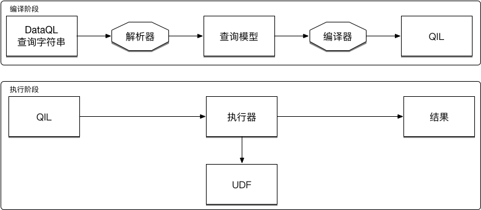

什么是DataQL？
------------------------------------
DataQL（Data Query Language）DataQL 是一种查询语言。旨在通过提供直观、灵活的语法来描述客户端应用程序的数据需求和交互。

数据的存储根据其业务形式通常是较为简单的，并不适合直接在页面上进行展示。因此开发页面的前端工程师需要为此做大量的工作，这就是 DataQL 极力解决的问题。

例如：下面这个 DataQL 从 user 函数中查询 id 为 4 的用户相关信息并返回给应用。

.. code-block:: js
    :linenos:

    return userByID({'id': 4}) => {
        'name',
        'sex',
        'age'
    }

返回结果：

.. code-block:: json
    :linenos:

    {
        'name' : '马三',
        'sex'  : 'F',
        'age'  : 25
    }

在比如：性别数据的字典映射，为此您可以通过 DataQL 的表达式进行快速的转换。从而无需任何服务端和前端的开发。

.. code-block:: js
    :linenos:

    return userByID({'id': 4}) => {
        'name',
        'sex' : (sex == 'F') ? '男' : '女' ,
        'age' : age + '岁'
    }

返回结果：

.. code-block:: json
    :linenos:

    {
        'name' : '马三',
        'sex'  : '男',
        'age'  : '25岁'
    }

还可以定义一个查询函数来重用这一逻辑。

.. code-block:: js
    :linenos:

    var sex_str = (sex) -> {
        return (sex == 'F' ? '男' : '女');
    }
    return userByID({'id': 4}) => {
        'name',
        'sex' : sex_str(sex),
        'age' : age + '岁'
    }

架构
------------------------------------

特性
------------------------------------
DataQL 有一些设计原则，这也使其成为有一定的特性。

- **层次结构**：多数产品都涉及数据的层次结构，为了保证结构的一致性 DataQL 结果也是分层的。
- **数据为中心**：前端工程是一个比较典型的场景，但是 DataQL 不局限于此（后端友好性）。
- **弱类型定义**：语言中不会要求声明任何形式的类型结构。
- **简单逻辑**：具备简单逻辑处理能力：表达式计算、对象取值、条件分支、lambda和函数。
- **编译运行**：查询的执行是基于编译结果的。
- **混合语言**：允许查询中混合任意的其它语言代码，典型的场景是查询中混合 SQL 查询语句。
- **类 JS 语法**：类JS语法设计，学习成本极低。

基于这些原则和特性，DataQL变为构建应用程序的强大而高效的环境。

目前 DataQL 提供了 Java 版的指令执行引擎，使用这个引擎您只需要依赖一个 Jar 包即可。任何一个Web应用或者 Spring Boot 的 jar 应用使用都变得非常容易。

.. CAUTION::
    请注意 DataQL 不是一门脚本语言，它对逻辑的处理仅限于简单场景。DataQL 的解决问题的重点集中在：数据的聚合和转换以及过程中的简单加工处理。
