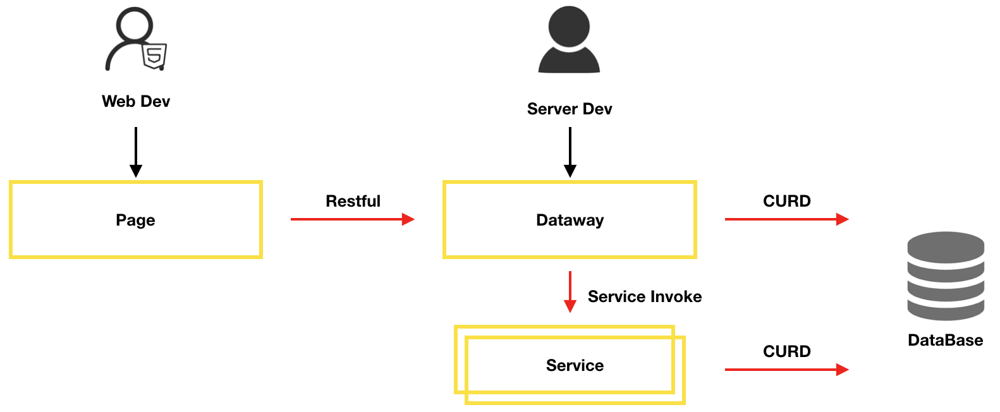
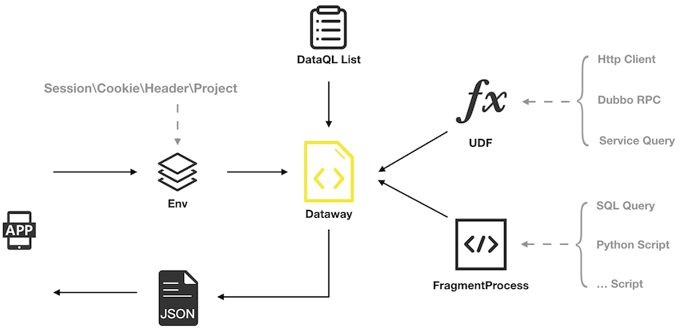

介绍
------------------------------------
Dataway 是基于 DataQL 服务聚合能力，为应用提供的一个接口配置工具。使得使用者无需开发任何代码就配置一个满足需求的接口。
整个接口配置、测试、冒烟、发布。一站式都通过 Dataway 提供的 UI 界面完成。UI 会以 Jar 包方式提供并集成到应用中并和应用共享同一个 http 端口，应用无需单独为 Dataway 开辟新的管理端口。

这种内嵌集成方式模式的优点是，可以使得大部分老项目都可以在无侵入的情况下直接应用 Dataway。进而改进老项目的迭代效率，大大减少企业项目研发成本。

Dataway 工具化的提供 DataQL 配置能力。这种研发模式的变革使得，相当多的需求开发场景只需要配置即可完成交付。
从而避免了从数据存取到前端接口之间的一系列开发任务，例如：Mapper、BO、VO、DO、DAO、Service、Controller 统统不在需要。

如上图所示 Dataway 在开发模式上提供了巨大的便捷。虽然工作流程中标识了由后端开发来配置 DataQL 接口，但这主要是出于考虑接口责任人。
但在实际工作中根据实际情况需要，配置接口的人员可以是产品研发生命周期中任意一名角色。

主打场景
------------------------------------
.. HINT::
    主打场景并不是说 Dataway 适用范围仅限于此，而是经过多次项目实践。我们认为下面这些场景会有非常好的预期效果。

**取数据**
  - 在一些 ``报表、看板`` 纯展示类的项目中。我们做到了所有接口真正的 零 开发全配置。所有取数逻辑全部通过 DataQL + SQL 的方式满足。
    在此期间遇到最大的挑战是复杂查询中需要 拼SQL，随着 DataQL 查询组件的完善，这一问题被攻克。
  - 对比往期项目对于后端技术人员的需求从 3～5 人的苦逼通宵加班，直接缩减为 ``1 人配置化搞定`` 。即便是第二天要上线新的逻辑，通过 DataQL + SQL。依然可以分分钟满足需求变更。

**存数据**
  - 在内部某个类 ERP 项目中，20多个表单页面。每个表单页面或多或少都有直接将单据数据录入到数据库的场景，每个单据的录入逻辑都有很大的不同。
    我们通过 DataQL + SQL 的方式在早期用了1000 行左右的核心代码。其它数据存取逻辑全部配置化完成。
  - 如今随着 DataQL 工具链的完善，其中绝大部分场景可以完全配置化无需开发了。

**数据聚合**
    - 和 GraphQL 相同，这是设计 DataQL 的初衷。将数据库和服务等多个结果进行汇聚然后返回给前端，这是 DataQL 的使命。 Dataway 是这一过程变得更加简单和高效。

.. CAUTION::
    随着 DataQL 工具链的逐步丰富和扩充，很多人会认为 DataQL 是否是一门新的编程语言？
    在这里还需要再次明确：DataQL 的设计初衷是数据的聚合和转换以及过程中的简单加工，因此它不是编程语言。虽然它具备了一些编程性，对逻辑的处理 DataQL 仅限于简单场景。

技术架构
------------------------------------
- Dataway 的架构中需要两张数据库表用来存放配置和发布的 DataQL 查询。
- 除此之外  Dataway 的架构极其简单，它只是相当于给 DataQL 披了一张皮。通过这张皮以界面的方式交互式执行 DataQL 语句，并将其管理起来。

刚刚接触 Dataway 很可能是由于看中它可以提取数据给前端这一个点，如果是这样可能会有一些错觉认为 DataQL 是一个高级别的 ORM 工具。因此这一点需要澄清，DataQL 的竞品应是 GraphQL，而非 ORM 框架。

ORM误区
  - ORM 最大的特点是具有 Mapping 过程，然后通过框架进行 CURD 操作。例如：Mybatis、Hibernate，其中有一些甚至做到了更高级的界面化例如： apijson，但其本质依然是 ORM。
  - DataQL 有很大不同，虽然 DataQL 提供了非常出色的基于 SQL 数据存取能力。但是无论从任何角度去看它都没有 ORM 中最关键的 Mapping 过程。能够看到最接近的只有 DataQL 对数据的结果转换能力。
  - 造成 ORM 错觉的是由于 DataQL 充分利用 Udf 和 Fragment 奇妙的组合，提供了更便捷的数据库存储逻辑配置化。但从技术架构上来审视它并不是 ORM。

