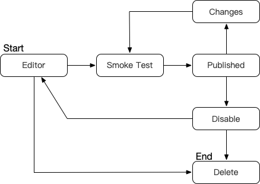
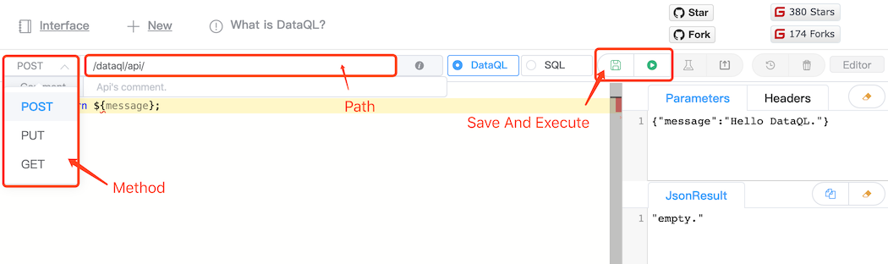
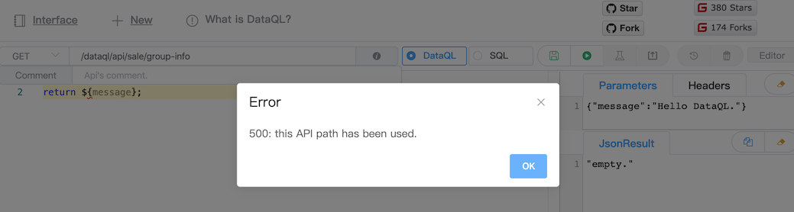
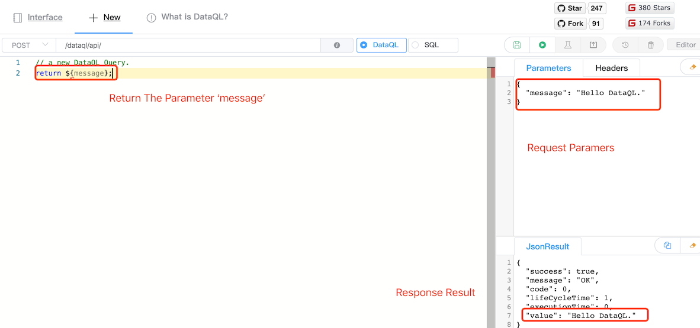
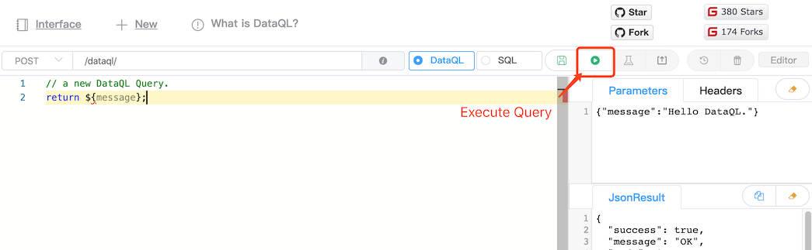
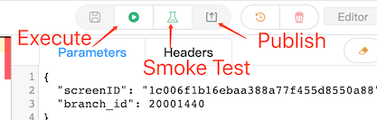
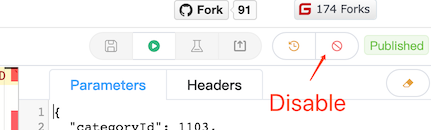
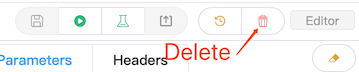
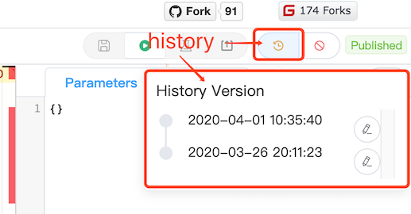

接口状态流转
------------------------------------

- **Editor**：编辑状态，接口不可访问。
- **SmokeTest**：冒烟测试是一个动作。只有冒烟测试通过之后才能进行发布操作，冒烟测试状态不会被持久保存。
- **Published**：接口已发布可以正常访问，并且无增量变化。
- **Changes**：接口已经发布可以正常访问，但是有后续变更尚未发布。此时访问接口是上一次发布的查询逻辑。
- **Disable**：无效接口，说明接口曾经发布成功过。此时将接口进行下线处理。在编辑器页面可以修改重新发布。
- **Delete**：接口已删除，被删除的接口会被真正的物理删除。interface_release 表中会保留历史数据。

新增
------------------------------------
点击页面顶部的 New 就可以进入新增接口页面

在新增页面中，最主要的是要设置API的请求地址和方法。在保存 API 的时候 dataway 会对 Api 地址进行校验。
合法的API地址中只能包含下列字符： ``! $ ' ( ) * + , - . / : ; = @ _ ~ [0-9] [a-z] [A-Z]``

编辑器中开放了 ``POST、PUT、GET、DELETE`` 四个可选的 Http Method。

在保存时如果遇到错误会有类似下面这样的提示（下列是，API地址冲突的错误提示）

.. CAUTION::
    请注意 API 创建就不允许修改请求地址和方法，可以删除重建API来达到更名目的。

新增接口时会展示一段 HelloWord 用例，这个用例中包含了请求一个接口传入一个 ``message`` 参数，然后利用 DataQL 查询获取这个参数并将其返回。
开发者可以在新建接口时直接点击工具条中的 ``Execute`` 图标执行得到运行结果。

执行
------------------------------------
在任意的编辑器界面中（新增模式 or 编辑模式），都可以直接在编辑区编写 DataQL 查询并通过右上角的 ``Execute`` 按钮执行。

发布
------------------------------------
当接口开发配置完成，需要将其发布以供使用。一个接口的发布上线要经历三个过程，具体如下：

**Execute**，调试当前编辑器中的 DataQL 查询。

**Smork Test**，冒烟测试。和 Execute 不同，Smork 同样是执行 DataQL 查询并要求查询正常执行完毕。
但是区别 Execute 的是 Smork 不会使用编辑器中的 DataQL 查询语句，而是到数据库中获取对应的查询语句。
因为接口的发布也是将数据中的 DataQL 查询语句进行发布。

**Publish**，当冒烟测试通过之后就可以点击发布按钮把接口发布上线了。每次发布 Dataway 都会在 interface_release 表中新增一条记录。

删除/下线
------------------------------------

已经发布上线的接口只能执行接口下线操作。

已经下线的接口或者正在编辑中的接口可以执行删除操作，删除操作会物理删除 interface_info 表中对应的记录。
但是删除操作并不会删除曾经的发布历史，这就留给我们了一条可以找回被删除的接口曾经发布过的历史记录。只不过这一步只能进入数据库中自行搜索。

发布历史
------------------------------------
每个 Dataway 上的接口在发布时都会 在 interface_release 表中生成一条记录。发布历史看的就是这里的记录。

在历史记录列表的右侧 icon 按可以恢复历史记录的内容到编辑器中。
