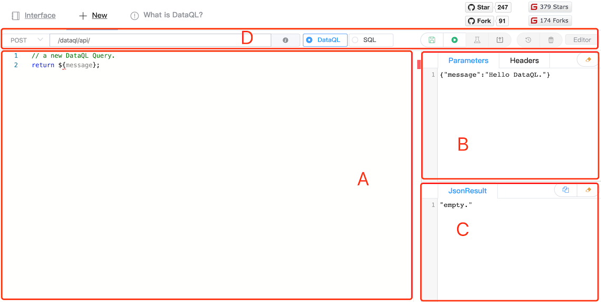
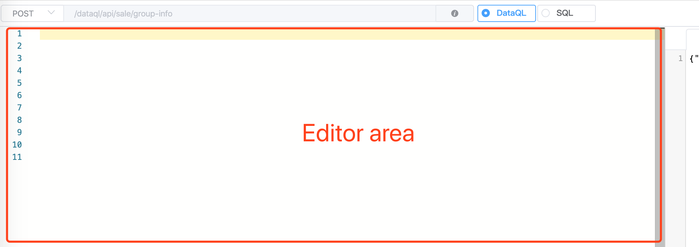
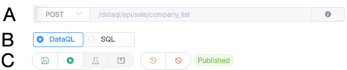

--------------------
新建/编辑页
--------------------

新建/编辑页中操作区主要被分为四个区块，分别为：

  - **A**：编辑区，用于书写编辑 DataQL 查询。
  - **B**：测试接口参数配置区（使用方式同列表页，不同的是接口执行按钮，被移动到了功能区）
  - **C**：测试结果响应区（使用方式同列表页）
  - **D**：功能条

编辑区
------------------------------------

编辑器采用的是微软开源编辑器 MonacoEditor，编辑器自身提供了很多工具。例如：查找替换等能力。

除此之外编辑器最重要的是提供一个可以代码着色的能力，目前开源版本中编辑器的着色方案选用的是 javascript 方式。
随着后续工具完善会逐步丰富 DataQL 自己的编辑器。

功能条
------------------------------------

其中功能条部分由下列三个部分组成，具体功能条中的操作将会下面功能介绍环节逐步涉略。

  - **A**：设置/展示 数据接口的 Http 请求方法和接口地址，以及接口备注信息。
  - **B**：编写的查询内容类型，目前可选：DataQL、SQL 两种语言
  - **C**：按钮区
