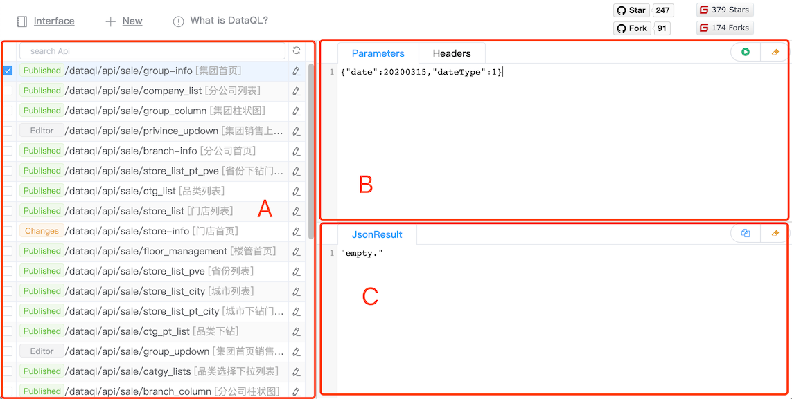
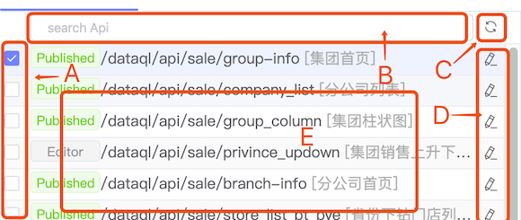
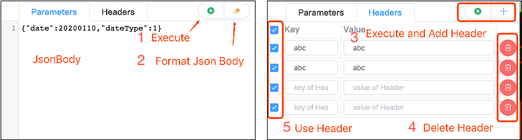
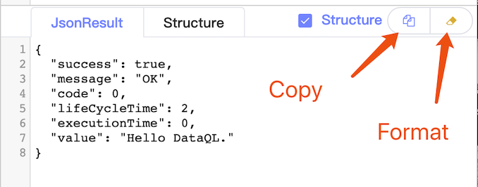

--------------------
列表页
--------------------

**List**：接口列表页，页面上分为三个区块分别为：

  - **A**：API列表区
  - **B**：调用接口参数配置区
  - **C**：响应结果区

API列表
------------------------------------
列表页的列表区块是用来展示在 Dataway 中管理的所有接口，按照 API 创建时间升序排序。

在这个区块中使用者可以做 五类事情。

  - **A**：选择其中一个 Api 之后在列表页的请求区块中调用这个接口。
  - **B**：搜索接口，搜索过滤条件是包含接口名的一部分或者描述中的一部分内容。
  - **C**：刷新接口列表的内容，从数据库中重新读取最新的列表.
  - **D**：点击其中一个接口的编辑图标进入这个接口的编辑页面。
  - **E**：这个区域是用来显示接口的信息，最左侧的 Tag 是显示接口的状态，最右侧会显示接口的备注。如果一整行显示不下会有 hover 提示。

调用接口
------------------------------------
接口调用有2个选项卡，如下分别是配置请求的 Body 和 Header 信息。整个区块内含有 5 个功能点。

**Parameters**

  - 执行：真正的发起调用并获取返回值。被调用的接口必须是已发布的，被执行的逻辑也是最后一次 Publish 的逻辑。
  - 格式化：对 requestBody 的 Json 内容进行格式化。

**Header**

  - 新增：临时性的新增一个 Header，要想永久性操作需要到编辑页中新增。
  - 删除：临时性的删除 Header，对于Header参数永久删除需要到编辑页面中删除。
  - 选择框：可以多选或者全选，含义是当发起执行的时候，哪些 Header 会被发往服务器。

响应结果区
------------------------------------

结果区是用来展示接口请求的结果，在这个区块中含有两个功能。

**JsonResult**

  - 拷贝：把结果区的内容拷贝到剪切板。
  - 格式化：对 json 内容进行格式化。
