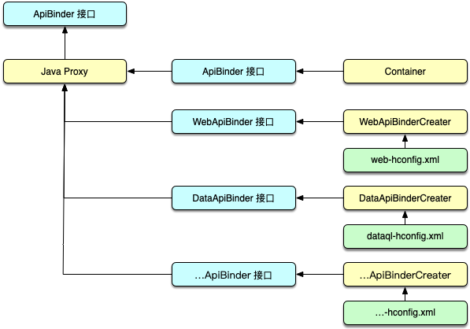

ApiBinder 扩展机制存在的意义在于，可以帮助应用或工具框架在 init 阶段构建自己的交互接口。

.. HINT::
    ApiBinder 扩展机制是从 Hasor 2.3 之后加入的。

原理
------------------------------------
在 Hasor init 过程的 newApiBinder 阶段，Hasor 会从配置文件中收集所有 ApiBinder 扩展点并创建它们。

被创建的扩展点对象会存放在一个叫 supportMap 的 Map 中，Map 的 key 是用户自定义的 ApiBinder 接口。
在下面例子中这个类型是 `net.test.binder.TestBinder`。

最后这些扩展点类型会通过 Java 的动态代理机制归纳到一个对象身上，完整的处理逻辑在 `net.hasor.core.context.TemplateAppContext` 类中。

演示样例
------------------------------------
首先在 Hasor 的配置文件中注册一个 ApiBinder 扩展。其中 TestBinderCreater 类实现了 `net.hasor.core.binder.ApiBinderCreater` 接口。

.. code-block:: xml
    :linenos:

    <?xml version="1.0" encoding="UTF-8"?>
    <config xmlns="http://helloword.youhosts.com/sechma/main">
        <hasor.apiBinderSet>
            <!-- 注册扩展 -->
            <binder type="net.test.binder.TestBinder">net.test.binder.TestBinderCreater</binder>
        </hasor.apiBinderSet>
    </config>

其中地址 `http://helloword.youhosts.com/sechma/main` 是一个虚拟存在的地址，这个地址被用作 Xml 命名空间。

TestBinderCreater 实现如下：

.. code-block:: java
    :linenos:

    public interface TestBinder extends ApiBinder {
        public void hello();
    }
    public class TestBinderImpl extends ApiBinderWrap implements TestBinder {
        public TestBinderImpl(ApiBinder apiBinder) {
            super(apiBinder);
        }
        public void hello() {
            System.out.println("Hello Binder");
        }
    }
    public class TestBinderCreater implements ApiBinderCreater {
        public TestBinder createBinder(ApiBinder apiBinder) {
            return new TestBinderImpl(apiBinder);
        }
    }

最后启动 Hasor 并加载配置文件来使用这个扩展：

.. code-block:: java
    :linenos:

    Hasor.create().mainSettingWith("my-hconfig.xml").build(apiBinder -> {
        TestBinder myBinder = apiBinder.tryCast(TestBinder.class);
        myBinder.hello();
    });

当程序运行到 `myBinder.hello()` 之后，控制台就会打印出 "Hello Binder"。

关于tryCast
------------------------------------
tryCast 会做尝试转换，如果 apiBinder 并未加载 TestBinder 扩展，tryCast 会返回 null。因此 tryCast 函数的功效等同于：

.. code-block:: java
    :linenos:

    if (apiBinder instanceof TestBinder) {
        return (TestBinder)apiBinder;
    } else {
        return null;
    }
