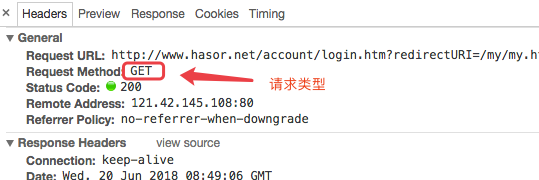

接收请求
------------------------------------
接收Web请求，下面是最简形态：

.. code-block:: java
    :linenos:

    @MappingTo("/helloAction.do")
    public class HelloAction {
        public void execute() {
            ...
        }
    }

使用IoC
------------------------------------
请求处理的类的属性可以被依赖注入：

.. code-block:: java
    :linenos:

    @MappingTo("/helloAction.do")
    public class HelloAction {
        @Inject
        private PayService payService

        public void execute() {
            ...
        }
    }

.. HINT::
    具体依赖注入部分内容可以在【2.2. 依赖注入(IoC)】查阅。

获得Request接口
------------------------------------
由于 Request 的存在周期很特殊，因此不能通过 `@Inject` 方式进行常规的注入。Hasor 提供了一种便捷的方式拿到它：

.. code-block:: java
    :linenos:

    @MappingTo("/helloAction.do")
    public class HelloAction {
        public void execute(HttpServletRequest request) {
            ...
        }
    }

.. HINT::
    可以在方法中被注入的类型有

+---------------------------------------------+--------------------------------+
| **接口**                                    | **说明**                       |
+---------------------------------------------+--------------------------------+
| `javax.servlet.ServletRequest`              | ServletRequest                 |
+---------------------------------------------+--------------------------------+
| `javax.servlet.http.HttpServletRequest`     | HttpServletRequest             |
+---------------------------------------------+--------------------------------+
| `javax.servlet.ServletResponse`             | ServletResponse                |
+---------------------------------------------+--------------------------------+
| `javax.servlet.http.HttpServletResponse`    | HttpServletResponse            |
+---------------------------------------------+--------------------------------+
| `javax.servlet.http.HttpSession`            | HttpSession                    |
+---------------------------------------------+--------------------------------+
| `javax.servlet.ServletContext`              | ServletContext                 |
+---------------------------------------------+--------------------------------+
| `net.hasor.web.Invoker` 或自定义扩展子类型  | 用来表示一次请求调用           |
+---------------------------------------------+--------------------------------+
| `net.hasor.web.render.RenderInvoker`        | Invoker 扩展，用来处理页面渲染 |
+---------------------------------------------+--------------------------------+
| `net.hasor.web.valid.ValidInvoker`          | Invoker 扩展，用来处理表单验证 |
+---------------------------------------------+--------------------------------+
| `net.hasor.core.AppContext`                 | 容器接口                       |
+---------------------------------------------+--------------------------------+
| `net.hasor.core.Environment`                | 环境接口                       |
+---------------------------------------------+--------------------------------+
| `net.hasor.core.Settings`                   | 配置相关接口                   |
+---------------------------------------------+--------------------------------+

区分请求类型
------------------------------------
如果你不知道什么是请求类型，那么请看这里

Hasor默认是接收所有类型的请求，如果想区分请求类型。可以如下例子：用不同方法接收 POST 和 GET

.. code-block:: java
    :linenos:

    @MappingTo("/helloAction.do")
    public class HelloAction {
        @Post
        public void doPost() {
            ...
        }
        @Get
        public void doGet() {
            ...
        }
    }

Hasor 默认提供的请求类型注解有

+--------------+--------------------------+
| **注解**     | **含义**                 |
+--------------+--------------------------+
| `@Any`       | 表示任意类型的请求       |
+--------------+--------------------------+
| `@Get`       | 表示 GET 请求            |
+--------------+--------------------------+
| `@Post`      | 表示 POST 请求           |
+--------------+--------------------------+
| `@Put`       | 表示 PUT 请求            |
+--------------+--------------------------+
| `@Head`      | 表示 HEAD 请求           |
+--------------+--------------------------+
| `@Options`   | 表示 OPTION 类请求       |
+--------------+--------------------------+

.. HINT::
    Hasor 中是支持同时标记多种请求类型处理标记的，例如：同时使用 `@Get` 和 `@Post`

自定义请求类型
------------------------------------
通常请求是浏览器发起的，请求类型也是固定的。如果使用了 ajax 框架或者非浏览器发起请求，那么请求类型实际上是可以被修改的。Hasor 支持自定义

例如：接收请求类型为“ABC”方法调用

.. code-block:: java
    :linenos:

    @Target({ ElementType.METHOD })
    @Retention(RetentionPolicy.RUNTIME)
    @HttpMethod("ABC")
    public @interface ABC {
    }

然后在接收请求时指定它

.. code-block:: java
    :linenos:

    @MappingTo("/helloAction.do")
    public class HelloAction {
        @Abc
        public void doAbc() {
            ...
        }
        @Get
        public void doGet() {
            ...
        }
    }
